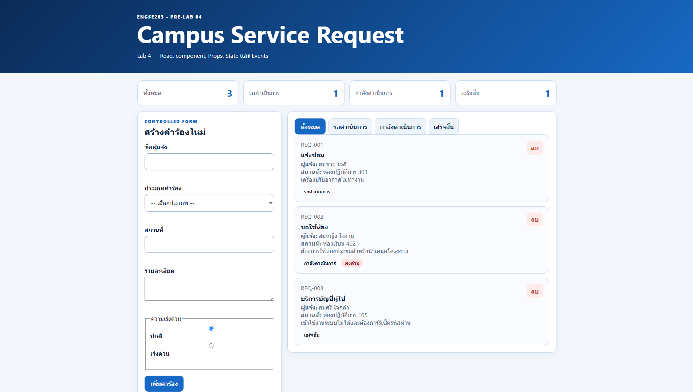
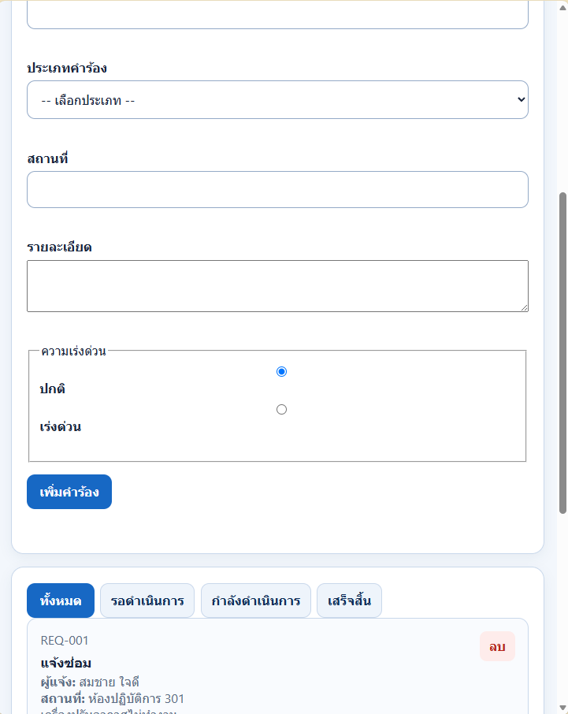
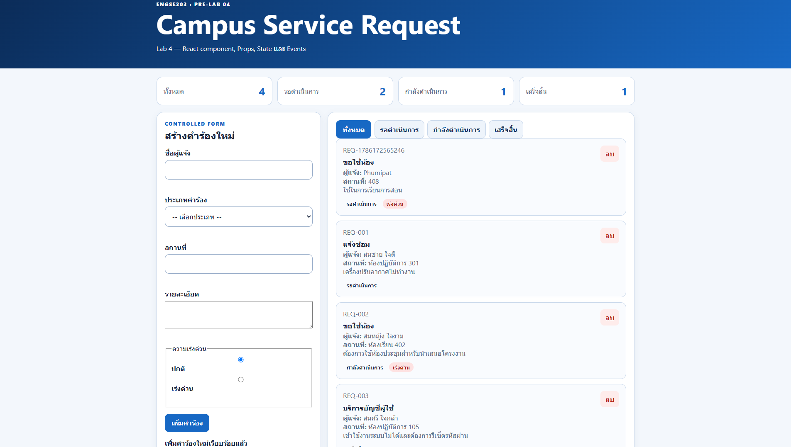
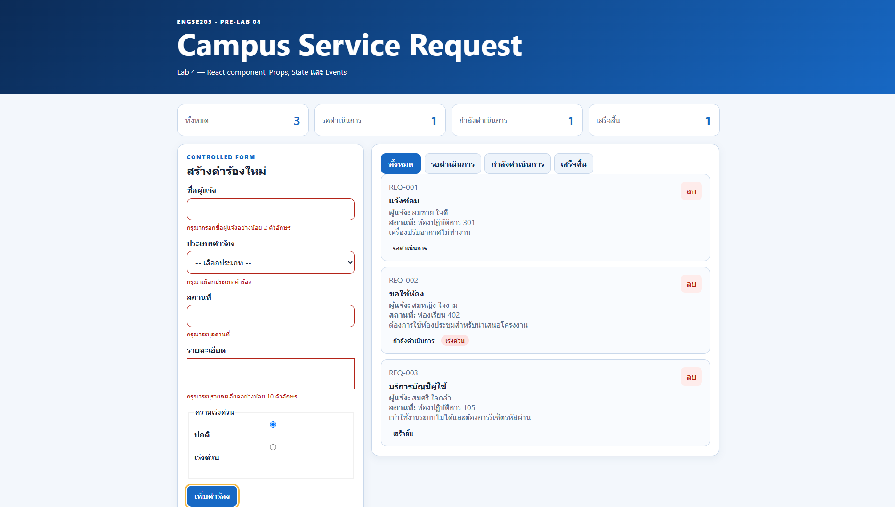

# หลักฐาน Week 04

## ผลการทดสอบ

- TC-01–TC-12 ผ่านตามเงื่อนไขของโจทย์
- `npm run build` ผ่าน
- `npm run preview` ผ่าน
- รูปภาพแสดง responsive, validation, empty state, และ initial render

## รูปภาพ

### Desktop

### Mobile 375px

### สถานะ validation

### สถานะ empty

## หมายเหตุ

- รูปทั้งหมดใช้งานได้จาก path ที่อยู่ในโฟลเดอร์นี้
- หากเปิดจาก GitHub ให้แน่ใจว่าไฟล์ภาพทั้งหมดอยู่ที่ `labs/week-04/evidence/`

## PR / Pages

- PR URL: https://github.com/Phumipat-2005/engse203-student-labs-68543210038-4/pull/4
- Pages URL: https://phumipat-2005.github.io/engse203-student-labs-68543210038-4/
